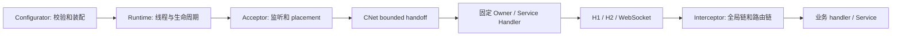

# HTTP 与 RPC 服务端

`src/` 包含 HTTP server、H1/H2 请求处理、路由、全局/路由级中间件、
Cookie Session、JWT admission、WebSocket server 与文件响应。
`rpc/` 包含 JSON-RPC server、方法注册、dispatch、batch 和结果/错误响应。
`examples/` 提供组合 IDL Service、Jinja 页面与 JSON-RPC 的服务端示例。

Session 由 HTTP server 持有，具备显式容量与 idle timeout。
使用 `chttp_session_get/set/remove/invalidate` 操作请求上的会话。
中间件使用 `chttp_server_use()` 注册，通过 `chttp_server_next_call()` 继续处理链；
路由也支持单独配置中间件。RPC server 通过 `crpc_server_http()` 暴露借用的 HTTP owner，允许在启动前配置这些能力。

IDL Service 可通过 `CHttp::App` 的 `chttp_service_mount_http_with_policies()`，
在挂载时按方法身份、BindingPlan 和 CMeta 签名选择类型化 Interceptor。
示例使用 `Salts::Component` 自动解析 Contract → Service 的依赖和回滚顺序；
策略、异步提交边界与迁移方式见 [App 装配说明](../app/README.md#reflected-method-policies-and-component-assembly)。

服务端 owner、并发提交、deferred response 与关闭协议保持不变。
服务端实现只引用本侧私有头、公共协议头和安装后的 Salts API，不访问客户端私有运行时。
公开入口为 `<http_server/http.h>`、`<http_server/rpc.h>`，位于本模块的 `include/`。
HTTP 和 RPC 服务端共同编入 `CHttp::Server`，无需链接客户端库。

## H1 WebSocket 专用传输策略（#238）

配套 Salts `2.3.0-rc.2` / SaltsUtils `4.3.0-rc.2` 提供显式启用的专用 H1
WS/WSS writer。Configurator 在启动前复制策略，不修改既有 server config 的布局：

```c
chttp_server_websocket_transport_options options =
    CHTTP_SERVER_WEBSOCKET_TRANSPORT_OPTIONS_INIT;
options.dedicated_h1 = 1;
int status = chttp_server_set_websocket_transport(&server, &options);
if (status != SALTS_OK) return status;
/* Register routes, then chttp_server_start(&server). */
```

默认 `dedicated_h1 = 0` 保持既有 copied writer 的接纳行为。`1` 选择 CNet 专用
bridge；H2 无论此值如何都使用现有 stream adapter。错误 size/version 或非 0/1
的值返回 `SALTS_EINVAL`，start 之后返回 `SALTS_EBUSY`，失败不修改策略。
选项按值复制，调用后无需保留 options。对 RPC server 可传入借用的
`crpc_server_http(&rpc_server)`，仍须在启动前配置。

选择可配置策略的原因是容量契约不同：既有 H1 writer 可同时保有在途副本和一个
engine 等待帧；专用 bridge 使用一个权威 output 槽。启用后，回调中的第二次发送
可能返回 `SALTS_EBUSY`，应用必须处理该结果。跨线程提交继续进入既有有界命令队列，
由固定 owner 在容量恢复后重试尚未接纳的命令，不重复已接纳的数据消息。server
text/binary 仍受单帧 `max_frame_bytes` 限制，不自动放宽为多帧消息。

握手顺序为 HTTP admission/认证 → `on_open` → 101 native 写完成 → bridge 绑定。
`on_open` 可发送一条 text/binary/ping/pong/close；旧 engine 只用于该阶段的协议校验，
其 writer 始终忙，不产生网络写入。成功接纳的逻辑输入复制到有界暂存区；101 完成
后创建 bridge、释放旧 engine，并转交暂存操作一次。该操作此前从未发往网络，不是
业务重放。握手拒绝或失败直接释放暂存区。OPEN 只表示 WS 建立，不代替 WS 内的
应用认证或业务 READY。

每个 owner 在既有 progress 循环中推进 bridge；data logical tag 仅在真实 native
完成后结算。HTTP 和 WS 不共用长度判断来识别写完成。首帧与 101 响应等长也不会
提前释放 frame。输入背压复用一个 `network.receive_buffer_bytes` 上限的 owned
接收块，显式跟踪一次在途 receive，暂停 demand 后在容量恢复时继续，重试路径不
重复增加 demand。新增 opening/output 存储计入
server buffer budget，engine 的内部固定容量仍按 route 配置分配；不新增线程或
无界队列。临时重叠的 opening engine 与 bridge 是握手交接成本，交接完成即释放。

关闭保留原先的 native terminal 顺序，并将 bridge 未释放纳入连接槽、Manager
context 和 stop drain 的保活条件。先结算 callbacks/tags/output，再释放 retained
frame 和连接上下文；WS 失败仅关闭对应连接，不停止整个 owner。该策略没有引入
ManagedDial、自动重连、Pool 替代拨号或消息重放。

直接替换默认 writer 会改变既有回调的接纳容量；把 `on_open` 延后到 101 之后则会
破坏认证拒绝的时机，因此采用上述显式策略。迁移时先处理回调的 `EBUSY`，再在
启动前启用；回滚设为 `0` 并重启 server。回滚到 rc.1 还需同时回退依赖该 bridge
的客户端改动和两个 SDK。当前没有性能收益声明。

正式 `chttp_websocket_test` 覆盖专用 WS 的 1/2/4 固定 owner、WSS、分片客户端、
等长 101/首帧、opening 拒绝/主动 close、排队容量恢复、128 轮双向数据/control
交错与有活动连接的 stop；
启用策略后也运行 H2 WSS/multiplex 回归，确认不绑定 H2 物理连接。
`chttp_server_configurator_test` 覆盖版本/值校验、复制和启动后拒绝，
`chttp_header_cpp_test` 验证 C++17 公共配置和链接。
Windows Clang Release 全量 94/94、MSVC Release 全量 90/90 通过，日志分别为
`build/rc2-server-clang-full.log`、`build/rc2-server-msvc-full.log`。
共享 SG、多协议邻居故障隔离、确定性 native 晚到完成、ManagedDial/lease 与
H2 stream 写完成专项仍属于 [#238](https://github.com/qigao/chttp/issues/238) 后续验收。
本轮没有 rc.2 ASan/TSan 或其他平台运行结果。

详细接口见 [HTTP 使用说明](../docs/HTTP.md)、[RPC 使用说明](../docs/RPC.md)，
deferred 生命周期见 [终态设计](ADR_DEFERRED_TERMINAL.md)。
`tests/` 保留服务端、Session/middleware、JWT、H2 和 RPC server 回归。

## WebSocket 命令调度与 ABI 后续设计（#238）

跨线程发送是 MPSC、复制接纳、每个 session 按发布顺序消费。owner 使用两个启动时
分配的定长描述符数组：生产者发布区和 owner 待处理区。每轮只处理开始时的快照，
最多 `network.command_capacity` 条；持续到来的提交留到下一轮。受阻 session 的
后续命令一起保留，其他 session 继续；旧重试项始终排在新发布项之前。两次线性遍历
和稳定压缩不分配 payload，不在锁内调用传输或业务回调。不同 H2 stream 分别判定
背压，物理连接自身的背压仍可能同时影响它们。

接纳槽数包含 `copying + published + retrying`，每个 owner 的总和不超过
`network.command_capacity`。生产者先在生命周期锁下 claim，再在锁外按既有 server
buffer budget 分配和复制，最后重新检查 shutdown 并 publish。分配或关闭失败先
释放 payload，再归还 claim；destroy 在 claim 未归零时返回 `SALTS_EBUSY`。停止
生产并完成 stop 后，尚未消费的命令由 destroy 释放，旧 API 不承诺 drain 成功发送。
复制中、排队中和重试中的 payload 都计入 `buffer_capacity_bytes`；因此过去绕过
预算的负载现在可能更早返回 `SALTS_ENOBUFS`，应用应处理背压或显式调整预算。
固定描述符数组按槽数单独分配，不算作 payload budget。

`chttp_websocket_commands_test` 用真实 CNet engine 和生产队列实现验证跨 session
推进、重试顺序、每轮有界工作、分配失败回滚、复制中的容量预留、销毁保护和字节
预算恢复；网络集成测试继续验证专用 bridge、TLS、H2 和多 owner。

现有 `chttp_server_ws_owner_benchmark` 可用 `CHTTP_OWNER_WS_WRITER=legacy|dedicated`
选择 writer，JSON measurement 的 `writer_policy` 防止混淆两种路径。启用
`BUILD_BENCHMARKS` 后通过 CTest 的同名 `_legacy` / `_dedicated` 测试运行；记录
1/2/4 owner、WS/WSS、16/32/64 KiB、callback echo/captured push 的吞吐、CPU 和分位
延迟。验证脚本拒绝将两种 writer 混入一个统计组。它不覆盖慢消费者混合、空闲大容量
或全部分配成本，因此不能据一次运行宣称普遍性能收益。

WS owner benchmark 的 CPU 使用线程累计 user + kernel 时间，按存活 owner 的线程
身份去重汇总。预热完成后采样起点，全部消息完成后先采样终点再释放客户端关闭屏障。
JSON 的 `cpu_time_kind=thread-user-kernel-v1`、`cpu_scope=server-owners` 和
`cpu_owner_count` 标明口径；必须覆盖全部配置 owner，否则本组失败。
`server_owner_cpu_ns_per_message` 是 owner CPU 总量除以消息数，
`server_owner_cpu_percent` 是 CPU 总量除以 wall time × 100%，一个核用满对应 100%。
它包含 owner 上的协议、回调、TLS 和 poll 工作，排除客户端、监听/后台线程及
captured-push 生产者侧的复制/接纳成本；不能当作整个服务进程或端到端总 CPU。

计时适配器只用于测试/benchmark，不读取 Salts 不透明线程句柄的内部表示。Windows
使用 [GetThreadTimes](https://learn.microsoft.com/en-us/windows/win32/api/processthreadsapi/nf-processthreadsapi-getthreadtimes)，
Linux 使用 [pthread_getcpuclockid](https://man7.org/linux/man-pages/man3/pthread_getcpuclockid.3.html)，
macOS 使用 Mach `THREAD_BASIC_INFO`。采样期间 owner 必须存活；不以 wall time 兜底。
短批次可能因系统计时粒度得到零 CPU，此时比例不可比较，应增大消息数。

历史 WS 日志中的 `cpu_ns_per_message` 作废：Windows CRT 的
[`clock()` 返回 wall time](https://learn.microsoft.com/en-us/cpp/c-runtime-library/reference/clock?view=msvc-170)，
在采用进程 CPU 语义的平台又会混入同进程客户端。校验脚本拒绝旧口径或口径混合。
历史吞吐和延迟字段仍是各自运行的测量结果。其他仍使用 `clock()` 的 HTTP/H2
benchmark 尚未迁移，其 CPU 字段也不能作为服务端 CPU 证据。

Windows Clang Release 的复验入口（SDK 环境与主构建一致，在 VsDevCmd 环境执行）：

```powershell
cmake --preset win-clang-release-user -DBUILD_BENCHMARKS=ON
cmake --build --preset win-clang-release-user --parallel 4
ctest --preset win-clang-release-user -LE '^$' -L benchmark -V
ctest --preset win-clang-release-user --output-on-failure
```

普通 test preset 排除 `benchmark` 标签；第三条命令显式覆盖该过滤器，仅运行
benchmark。CI 继续使用配置选项分离测试与 benchmark 构建。

2026-10-10，Windows IOCP、Clang Release、上述 rc.2 SDK 配对的未提交工作树：
全量功能回归 Clang 95/95、MSVC 91/91 通过，分别记录于
`build/ws-fairness-clang-full.log`、`build/ws-fairness-msvc-full.log`。
writer 完整矩阵每组重复三次，216 条 measurement 均无业务错误，记录于
`build/ws-fairness-writers-repeat.log`。这是修复后两种 writer 的比较，不是修复前后
的队列性能比较。

短批次波动明显，因此另外设置 `CHTTP_OWNER_WS_WORKLOAD=ws-push-64k`、
`CHTTP_OWNER_WS_LARGE_MESSAGES=1000`、`CHTTP_OWNER_WS_WARMUP=32`，通过同一 CTest
命令加 `--repeat until-fail:3` 复验。8 连接、每组 8,000 条消息、三次中位数如下；
完整日志为 `build/ws-fairness-push64k-repeat.log`：

| owner 数 | legacy 消息/秒 | dedicated 消息/秒 | legacy p99 / ms | dedicated p99 / ms |
| --- | ---: | ---: | ---: | ---: |
| 1 | 46,207.0 | 45,205.9 | 0.284 | 0.324 |
| 2 | 55,828.7 | 63,156.3 | 0.231 | 0.241 |
| 4 | 76,766.7 | 66,679.4 | 0.240 | 0.252 |

结果有升有降，继续保留 opt-in 策略；这些同机、固定顺序、有限重复的样本不能证明
普遍加速，也未隔离差异根因。尚未运行本次改动的 ASan/TSan、Linux/macOS 或慢消费者
混合负载 benchmark；队头阻塞由确定性正式测试验证。

CPU 口径修正后的验证（同日、同一 Windows rc.2 工作树）：Clang 96/96、MSVC 92/92
功能测试通过，日志为 `build/cpu-timing-clang-full.log` 和
`build/cpu-timing-msvc-full.log`。新增 `chttp_thread_cpu_test` 验证休眠和其他线程的
运算不计入本线程 CPU、跨线程读取存活线程的计数，以及无效状态/算术溢出。
WS/WSS 完整矩阵两种 writer 共 72 条 measurement 通过校验；其中 26 条短样本 CPU
为零，保留原值并将不可比较的比例标为 `n/a`，不当作“零成本”。历史日志已验证被
新脚本拒绝。完整矩阵记录在 `build/cpu-timing-writers-matrix.log`；Linux/macOS
计时分支尚未在本机验证。

长批次使用 8 连接、每连接 20,000 条 64 KiB WS push、32 条预热。先按 writer
分组各重复三次，再以 dedicated → legacy 的顺序交错三轮，均通过 CTest 与 JSON
校验。交错三轮的中位数如下，CPU 是 server owner 范围，不含生产者侧发送 API：

| owner 数 | legacy 消息/秒 | dedicated 消息/秒 | legacy owner CPU µs/消息 | dedicated owner CPU µs/消息 |
| --- | ---: | ---: | ---: | ---: |
| 1 | 47,622.0 | 47,289.1 | 20.703 | 20.703 |
| 2 | 60,711.9 | 56,591.3 | 32.031 | 33.105 |
| 4 | 91,144.1 | 82,925.5 | 38.770 | 40.918 |

分组初轮的 dedicated/4 owner 中位数仅 40,026.8 消息/秒、83.105 µs/消息，交错
复验变化明显。因此这些样本说明需要权衡吞吐与 CPU，尚不能给 writer 差异作稳定
归因或宣称 CPU 优化完成。原始记录为 `build/cpu-timing-push64k-repeat.log` 和
`build/cpu-timing-interleaved-{1,2,3}-{dedicated,legacy}.log`，按 writer 提取的
JSONL 和校验摘要也保存在 `build/cpu-timing-*`。后续先取得 owner 的 CPU 栈采样，
再决定是否把全容量扫描改为活跃/待处理集合，或优化队列锁与唤醒；保持既有 CNet
progress owner 和启动时 ACE/IDL 装配边界。

交错复验使用上面的 SDK/VsDevCmd 环境：

```powershell
$env:CHTTP_OWNER_WS_WORKLOAD = 'ws-push-64k'
$env:CHTTP_OWNER_WS_LARGE_MESSAGES = '20000'
$env:CHTTP_OWNER_WS_WARMUP = '32'
1..3 | ForEach-Object {
  foreach ($writer in @('dedicated', 'legacy')) {
    ctest --preset win-clang-release-user -LE '^$' -R "^chttp_server_ws_owner_benchmark_${writer}$" -V
    if ($LASTEXITCODE -ne 0) { throw "benchmark failed: $writer" }
  }
}
```

继续检查 owner 推进时修复了一个 `MED` 调度偏差：旧 `retry_pending` 在一轮循环中
一边用 `pending_retry_cursor + offset` 选槽，一边更新 `pending_retry_cursor`。
例如四个待处理槽从 0 开始，已完成动作清除后会访问 0、2、1、1，漏过槽 3。
现在本轮使用独立的递增环绕索引，持久游标只记录下一轮起点；复杂度仍为
O(owner 配置容量)、O(1) 额外空间，保持 `ENOBUFS` 让出、`EBUSY` 继续和终结清理契约。
没有增加通用调度框架。`chttp_server_retry_test` 走真实 CNet 停止后的 `ESHUTDOWN`
关闭重试路径，验证四种起点、非零 owner 区间、inactive 槽与非法区间；旧循环使
三个用例失败，修正后的最小回归通过。函数仅声明在内部 runtime 头中。

修复后的全量回归 Clang 97/97、MSVC 93/93 通过，分别见
`build/retry-cursor-clang-full.log`、`build/retry-cursor-msvc-full.log`。
红灯/绿灯证据为 `build/retry-cursor-red-test.log`、`build/retry-cursor-focused.log`。
修复后的 WS/WSS 矩阵 72 条、大容量长批次 12 条 measurement 均通过数据校验，
记录于 `build/retry-cursor-matrix.log`、`build/retry-cursor-capacity1024.log`。
本轮修复尚未执行 ASan/TSan 或 Linux/macOS 回归。

增加了以下 benchmark 控制项；配置写入 environment 和 measurement，校验脚本
拒绝混合容量、poll 间隔或空闲窗口：

| 环境变量 | 默认值 | 范围与含义 |
| --- | ---: | --- |
| `CHTTP_OWNER_WS_CAPACITY` | 32 | 已连接数至 4096；服务端总配置容量，保持实际连接数不变 |
| `CHTTP_OWNER_WS_POLL_MS` | 1 | 1..100 ms；传入现有 `poll_slice_ms` |
| `CHTTP_OWNER_WS_IDLE_MS` | 0 | 0..5000 ms；0 关闭空闲测量，正值在预热后测量已建立连接的 owner CPU |

客户端起跑和关闭屏障改用 Salts 条件变量，避免 yield 忙等或周期唤醒干扰空闲实验。
所有已创建线程退出后才销毁屏障；失败路径同时开放两个屏障，保留 owner 和 CPU
计时句柄直到采样完成。空闲窗口先等待 100 ms 让预热完成事件收尾；窗口结束后再
开始原有消息负载，空闲与忙时 CPU 分开统计。这不是零连接或整个进程的 CPU 测量。

Windows IOCP 空闲对照（游标修复前，8 个已连接客户端、2 秒窗口、每组两次，随后
发送每连接 1000 条 WS 64 KiB 消息）共 48 条结果通过校验。合并两种 writer 与
1/2/4 owner 后的总 owner CPU 范围如下，一个核为 100%：

| 总配置容量 | poll 间隔 | 空闲 owner CPU 范围 |
| ---: | ---: | ---: |
| 32 | 1 ms | 0..0.780% |
| 32 | 20 ms | 0..0.777% |
| 1024 | 1 ms | 0..2.336% |
| 1024 | 20 ms | 0..1.562% |

零值受 Windows CPU 计时粒度限制，不代表无成本。该样本不足以把空闲唤醒判定为
主要瓶颈；不据此修改生产默认 poll 间隔。另用每连接 20,000 条消息、容量顺序
32→1024 / 1024→32 的两轮忙时对照，legacy/1 owner 的 CPU 中位数由
22.314 增至 29.785 µs/消息，吞吐由 44,067 降至 33,148 消息/秒。容量同时影响
Chttp 和 CNet 配置，尚不能仅据该差异认定某个函数是 CPU 热点，也不能将这组
容量对照当作游标修复的性能收益。原始记录为 `build/cpu-idle-*.log` 和
`build/cpu-capacity-*.log`，对应 JSONL 与校验摘要保存在同目录。

同配置的游标修复前/后长批次各两次，1024 容量、4 owner 的 legacy 吞吐中位数
为 50,550→70,376 消息/秒，dedicated 为 51,238→42,166 消息/秒；后者两条
基线分别为 42,427 和 60,048，修复后为 42,062 和 42,269。结果有升有降且样本
有限，不能声称修复带来稳定 CPU 或吞吐收益；保留正确性修复，性能差异继续待归因。

本机 [WPR CPU 采样](https://devblogs.microsoft.com/performance-diagnostics/wpr-start-and-stop-commands/)
启动失败，返回 `0xc5585011`（无法启用系统性能分析权限），没有取得 CPU 调用栈。
应在具备权限的环境取得带符号的 owner 栈，再决定是否引入活跃/待处理集合。
当前 rc.2 CNet 自身已使用 session 工作队列和 deadline queue；不能因为上层存在
全容量扫描就重写底层或增加 Leader/Followers 线程迁移。

下面是尚未发布的 ABI 方案，不是当前可调用接口：

| 边界 | 拟采用的契约 | 验收条件 |
| --- | --- | --- |
| 异步发送扩展 | 新增 `_ex` 入口；非 OK 表示未接纳、无回调；OK 返回 operation 标识，终态恰好一次携带用户 tag 和状态 | stale session、路由限制、native 失败、stop 取消均可逐项关联；回调在 owner 上且不持有队列锁 |
| 阻塞发送扩展 | 返回值区分未接纳、已接纳仍在途、已终结；超时保留 operation 的可查询身份 | 接纳前/后超时分别测试；不自动重放；本地传输完成不等于对端执行 |
| H2 完成 | 将逻辑消息关联到具体 stream 的真实传输终态 | 不能以入 H2 输出队列当作发送完成；兄弟 stream 的完成/失败不能混用 |
| 配置 ABI | 冻结现有布局；新版本入口使用 Chttp 自有选项及明确版本/尺寸规则，内部适配 CNet | 旧/新头与旧/新库组合验证；支持旧版本转换或明确拒绝，不凭 `size` 猜布局 |
| 高级 buffer 接口 | 默认复制接口保留；有需求时另加显式 retained 语义 | 拒绝不转移所有权；接纳后释放只发生于权威终态；DSO 回调的 lease 覆盖全部在途使用 |

先实现并验证 H1/H2 的统一完成关联，再发布上述发送扩展。保留已有入口和配置布局
作为迁移路径；不修改已有函数的成功含义。Configurator、IDL/反射绑定和 Plugin
装配留在启动控制面，数据面执行预绑定操作；不为增加 Leader/Followers 模式迁移
既有 poll owner。队列公平性修复不依赖这些 ABI 扩展，也不宣称已解决终态可观察性。

## IDL + Configurator / Interceptor + Jinja 示例

`crpc_server_example` 保留 `/rpc` 的 `example.ping`（返回 `null`）和可选 `/file`，
新增 Jinja 首页 `/` 与 `GET /api/add?left=3&right=4`（返回 JSON 数字 `7`）。
`left` 为 1..4294967295，`right` 为 0..4294967295；结果使用 `uint64`，不在 32 位相加时溢出。
缺少/无法绑定参数返回 400，违反 IDL 的 `@Min(1)` 返回 422。

| 职责 | 实现 |
| --- | --- |
| 契约与生成 | [http_example.schema](examples/http_example.schema) 定义请求、响应及页面模型；[HTTP projection](examples/http_example.projection.json) 定义路径与字段来源；`salts_idl_target` 调用 SaltsUtils IDL 编译器生成 native 类型、CMeta 描述符与 Service adapter |
| Configurator | [http_example_configurator.c](examples/http_example_configurator.c) 复制应用配置、编译 MethodPlan、初始化模板/Service/限流器、绑定策略与路由；任一步失败按依赖顺序回滚，完成装配后由 main 启动监听 |
| Interceptor / middleware | [http_example_interceptor.c](examples/http_example_interceptor.c) 保留全局 `X-Example`，增加 `nosniff`；首页与 IDL 接口的路由级 middleware 设置 `Cache-Control: no-store`，文件缓存不受影响 |
| 业务与协议适配 | [http_example_business.c](examples/http_example_business.c) 实现生成的精确 typed operation，首页示例结果也来自此函数；[handlers](examples/http_example_handlers.c) 只适配页面、RPC 和文件响应 |
| 页面 | [templates](examples/templates/page.html.jinja) 使用继承和条件渲染；直接消费 IDL 生成的 `HomePage` CMeta 描述符，无手写平行字段表；由 `CHttp::App` 自动 HTML 转义 |

这是应用层的 ACE/POSA 职责划分，复用现有组件，没有新增 ACE 库依赖或通用服务定位器。
相较继续把装配和处理器放在 main，分离后的配置与清理可直接被正式 HTTP 测试复用；
现在支持启动期选择 native/DSO 后端，尚无在线替换。新增依赖仅在私有 example target，
`CHttp::Server` 本身不依赖 `CHttp::App` 或 Jinja。

`http_example_config_default()` 集中提供端口、标题、文件路径、三阶段 deadline 与限流参数。
调用方可在 `http_example_configure()` 前修改该内部配置；配置成功后没有热更新接口。
CLI 支持 `--port 0..65535`（默认 0，自动分配）、`--title TEXT`（1..256 字节）、`--plugin PATH` 和原有文件参数。
默认仍只监听 `127.0.0.1`。配置复制标题和文件路径，CORS 策略使用不可变静态存储。

应用 owner 的地址从配置到关闭必须稳定；单 Owner 串行使用不可重入的 Jinja renderer。
模板在构建时嵌入，编辑 `.jinja` 后重新构建即可，不依赖启动目录；渲染输出上限为 8192 字节。
关闭先 stop/destroy server，再销毁 Service、renderer、limiter、MethodPlan、codec 和拥有字符串的
IDL 模型。stop 失败时保留整个 owner 和依赖，调用方必须重试关闭后再回收。
原命令行与端点无需迁移；撤销示例层改动即可回到原 RPC 示例，服务端公开接口不变。

使用已配置 Salts/SaltsUtils SDK 的用户 preset（`BUILD_EXAMPLES=ON`）：

```powershell
cmake --build --preset win-clang-release-user
ctest --preset win-clang-release-user -R '^chttp_server_example.*test$' --output-on-failure
./build/Clang-Release/bin/crpc_server_example.exe --port 8080 --title 'My service' ./README.md
```

访问 `http://127.0.0.1:8080/`，或用首页表单提交加法请求；按 Enter 停止。
[正式测试](tests/chttp_server_example_test.c) 覆盖真实 HTTP 的生成绑定/校验/整数边界、
Jinja 继承/转义及配置复制、RPC/CORS、文件 ETag/304、配置限流与初始化失败回滚。
测试复用同一私有应用库，即使 `BUILD_EXAMPLES=OFF`，测试配置仍覆盖应用装配。

### Calculator DSO 的装配与资源协议

示例以 `--plugin PATH` 显式选择 `Salts::Plugin` DSO 后端；省略该选项继续使用 native 后端。
两者来自同一 IDL/业务实现，加载或契约校验失败直接阻止启动，不自动切回 native。
Configurator 拥有容量为 1 的 Plugin registry，以及单 worker、8 个任务容量的 CFlow executor；
HTTP Owner 负责参数绑定，Service 将拥有型调用帧交给 executor，队列满返回 503，不重试或改用 native。
回调中的 HTTP/CNet 借用视图不跨线程。请求返回后仍由任务 finalizer 完成帧清理。

启动先加载并启动 DSO，生成的 typed Plugin client 在 lease 下校验契约并计算首页示例，
随后释放该临时 client；HTTP mount 单独持有 lease，覆盖缓存的 execution、描述符与在途任务。
页面模型及 Jinja renderer 属于宿主，不依赖 DSO 中的存储。服务器仍保持固定 I/O Owner。

关闭在应用控制线程执行：停止服务端入场和 HTTP 活动，等待 executor 的所有任务完成，
再销毁 server/Service、executor，停止插件、确认 quiescence、卸载并销毁 registry。
等待受 `shutdown_timeout_ms` 限制，超时保留 owner 与依赖，可重试关闭；不强制卸载执行中的 DSO。
服务端已停止但保留运行错误时，示例继续释放依赖，完成清理后返回原错误并将 owner 归零；
清理尚未完成时继续保留 owner，后续 close 可以重试。
原有 native 选择可用于回滚部署。本例尚不支持在线替换、依赖自动求解或插件 interceptor。

`shutdown_timeout_ms` 默认为 5000，限制宿主的 stop/drain/quiescence 等待；同步插件
生命周期回调必须自行及时返回，宿主无法抢占卡住的插件代码。DSO 是同进程代码，需使用可信模块。

构建同时产出 `http_example.dll`（Linux 为 `.so`，macOS 为 `.dylib`）。显式运行 DSO 后端：

```powershell
./build/Clang-Release/bin/crpc_server_example.exe --plugin ./build/Clang-Release/bin/http_example.dll --port 8080
```

`chttp_server_example_plugin_test` 在 DSO 模式运行相同 HTTP/Jinja/RPC/文件回归。
另有真实 DSO 用例验证加载失败不回退、同名操作的返回类型不匹配、在途 lease 阻止卸载、
关闭超时后重试，以及 executor 满时 503、释放容量后恢复。测试 fixture 留在 `tests/`，
使用另一份生成契约构建不兼容 DSO，不修改生产插件来注入测试行为。

## CNet 策略与 ACE 模式的应用边界

服务端已经在真实 accept 路径调用 CNet Owner placement，再由有界 handoff 预留提交
容量。`chttp_server_set_owner_placement()` 是启动前的配置入口，支持轮询（默认）、
最低归一化压力及指定 Owner；指定 Owner 已满时直接拒绝，不转移到其他 Owner。
TCP accept 时没有 HTTP routing key，因此这里不支持 strict-key。已建立连接固定归属
一个 Owner，不按后续 HTTP 请求迁移。配置结构和函数见 [公开头文件](include/http_server/http.h)。

在 `init()` 成功之后、`start()` 之前可按以下顺序设置；`network.connection_capacity`
须至少为 4。每步返回失败即停止启动并走应用既有清理路径：

```c
chttp_server_execution_options execution = CHTTP_SERVER_EXECUTION_OPTIONS_INIT;
execution.owner_count = 4u;
int status = chttp_server_set_execution_options(&server, &execution);
if (status == SALTS_OK) {
    chttp_server_owner_placement_options placement = CHTTP_SERVER_OWNER_PLACEMENT_OPTIONS_INIT;
    placement.kind = CNET_OWNER_PLACE_LOWEST_PRESSURE;
    status = chttp_server_set_owner_placement(&server, &placement);
}
/* 仅 status == SALTS_OK 时继续注册并 start；启动后修改返回 SALTS_EBUSY。 */
```

服务端已按 ACE/POSA 的职责边界拆分内部实现。下表列出实际落点及能力边界；模式背景见作者的
[Advanced ACE Tutorial](https://www.dre.vanderbilt.edu/~schmidt/PDF/ACE-tutorial4.pdf)。

| 模式 | 本项目的落点及边界 |
| --- | --- |
| Strategy / Acceptor | [acceptor.c](src/chttp_server_acceptor.c) 负责监听、CNet 选择 Owner 和 handoff 发布；HTTP 路由策略不参与 socket 迁移 |
| Interceptor | [interceptor.c](src/chttp_server_interceptor.c) 负责全局/路由 middleware 链、一次性 continuation 和 HTTP 终端分派；正文前拒绝用 admission，认证保持 JWT 入口 |
| Service/Component Configurator | [configurator.c](src/chttp_server_configurator.c) 负责配置校验、容量默认值、Owner 拓扑装配和启动前策略绑定；应用控制面继续组织 Service/Plugin 挂载，尚无通用在线替换入口 |
| Acceptor/Connector、Reactor/Proactor | 继续由 CNet/NativeIO 承担连接与平台 I/O；HTTP 层消费其完成和所有权协议 |
| Half-Sync/Half-Async | 现有 deferred Service 执行连接 Owner 与有界 executor；不在 I/O Owner 上执行阻塞业务 |

### 本次重构的职责和生命周期

原 `chttp_server.c` 同时承担资源装配、监听接纳和协议推进，路由文件还承担 middleware
执行。现在 Configurator、Acceptor、Interceptor 各自形成实现单元，路由文件只负责
注册与匹配；`chttp_server.c` 保留线程启动/退出屏障、固定 Owner 上的 Service Handler、
H1/CNet 回调及 drain，H2 和 WebSocket 继续使用各自协议模块。



初始单 Owner 和启动前变更 Owner 数量共用 prepare/commit 路径：先准备全部 handoff、
文件传输槽、WebSocket 命令槽和 placement scratch，成功后替换旧拓扑并绑定连接范围；
任何准备失败仅释放候选资源，旧策略、旧连接归属和 middleware 绑定继续有效。
server 的不透明 impl 仍是配置和资源的唯一事实源，没有额外 registry 或配置镜像。
Acceptor 的 listener、选择游标和 scratch 聚合在私有 `chttp_server_acceptor` 中。

接纳时 descriptor 和 credit 的所有权只在成功 `handoff publish` 后转交 Owner。
publish 前失败由 listener 关闭/归还；publish 后 wake 失败仍由 Owner 负责排空。
Runtime 等待 `listener_done` 后才取消 inbox，并等待协议、deferred、Manager context
全部终结再释放配置存储。线程数、容量、满载拒绝与关闭顺序保持既有契约。

Interceptor 的 `next` 状态收进实现文件，只保留当前请求栈上的游标，不能跨 callback
保存或转交线程。H1/H2 使用同一 HTTP 分派逻辑，WebSocket 升级继续复用同一 middleware
执行器和自己的 terminal handler；404/405、`Allow`、默认 204、错误 500、Session
提交/回滚及 deferred 的现有行为均保留。

选择直接的内部 C 模块分工，复用现有函数和对象；未引入 ACE 库、通用 vtable 或新的
公开类型。候选的完整动态组件容器需要额外依赖、注册与热替换协议，本次不采用。
公共头文件和配置格式不变，调用方无需迁移；回滚应整体撤回这三个实现单元、私有布局
及 CMake 源列表调整，不单独回滚某个 handoff/配置函数。重构没有性能收益的测量结论。

2026-10-10 的 rc.3 源码审查后，Owner 的 Manager 退休推进改为私有侵入链表：
真实 CLOSED/FAILED 回调或同步 adopt 拒绝登记一次，Owner 只检查这些退休候选。
WS native bridge、H1 deferred token 或 H2 deferred stream 尚未结束时继续保留 context；
条件满足后释放一次 hold，再由 Manager advance 回收。链表借用已有连接槽，容量不超过
该 Owner 的连接上限，不分配节点、不跨线程修改。空列表不读取完整连接数组；接纳 inbox
为空时也不搜索空闲连接。关闭和 deferred 的事实源仍是 CNet/协议状态，链表只是派生索引。

[Manager 退休测试](tests/chttp_server_manager_test.c) 使用真实 CNet/Manager；空列表用
NULL 连接数组证明无遍历，另外验证链表头/中/尾、延迟释放、重复登记和代际复用。
该改动消除了 Manager 外围的空闲全表扫描；协议自身的推进和重试扫描仍保留，不能据此
推导 CPU 百分比收益。回滚可仅恢复原 Manager 外围扫描和 inbox 检查，公开 ABI 不变。

保持固定网络 Owner：rc.3 的 SG Host 适用于同一 shard 上的共同 I/O 宿主，要求唯一
observe authority 和完整 completion batch 路由。当前服务端没有需要合并的第二类本机
I/O consumer，因此不为统一形式增加 SG 后端，也不把测试中的 Leader/Followers 改成
网络线程调度。现有 Configurator/Interceptor 与 IDL MethodPlan、Plugin lease 继续各司
其职；Component 在线装配、自动重连和共享宿主需要独立的业务需求及生命周期契约。

本轮 Manager/WS 重构的 Windows 验证（2026-10-10）：

| configure/build/CTest preset | SDK 来源 | 全量结果 |
| --- | --- | --- |
| `win-clang-release-user` | Salts `2.3.0-rc.2` + SaltsUtils `4.3.0-rc.2` 发布 SDK | 99/99，30.17 秒 |
| `ci-sdk-release-user`，configure 显式启用 `BUILD_TESTING`/`BUILD_TESTS` | 同上，MSVC Release，关闭示例 | 95/95，28.71 秒 |
| `win-dev-user` | Salts rc.3 源码含关闭修复 + SaltsUtils rc.2 源码，均重新构建 Debug/ASan | 99/99，69.10 秒，无 ASan 报告 |

Debug 依赖分别来自 Salts `21a88ca4d80a76341fb8164cd33ceed3a3eb3d57`（加本轮
ManagedDial 修复）和 SaltsUtils `c96a47b05292e3bbebba0b016c0b18c71bce8cde`。
先在隔离 checkout 使用各自 `win-dev-user` configure preset，关闭依赖测试、示例和
benchmark，并指定隔离的 `CMAKE_INSTALL_PREFIX`；SaltsUtils 同时关闭 capture，
`SALTS_ROOT` 指向刚安装的 Debug Salts。然后用各自 `install-win-dev-user` build
preset 安装；Chttp 的 `SALTS_ROOT`/`SALTS_UTILS_ROOT` 指向这两个 Debug SDK。
原 rc.1 Debug SDK 缺少 `cnet/websocket_transport.h`，未作为本轮通过证据。
不要将 Release NuGet 库补入 Debug graph。

Chttp 各环境先执行 `cmake --preset <preset>`（SDK preset 加
`-DBUILD_TESTING=ON -DBUILD_TESTS=ON`），再执行 `cmake --build --preset <preset>`
和 `ctest --preset <preset> --output-on-failure`。本地结果保留在
`build/refactor-clang-full.log`、`build/refactor-msvc-full.log`、
`build/refactor-asan-full.log`。Salts 的 Manager/ManagedDial/ClientPool、TCP/TLS
composition 和 SG hosted/handoff 7 项回归分别在 Release、Debug/ASan 通过。
此次未执行 Linux/macOS、TSan 或 CPU 对照基准。

[Configurator 测试](tests/chttp_server_configurator_test.c) 对生产配置单元的本地分配逐一
注入失败，验证初始构造不发布半成品、拓扑调整失败保持旧状态，以及失败后成功启动。
它使用真实 CNet/handoff 和协议存储；分配注入只存在于正式测试的翻译单元中。
既有 Owner topology、middleware/Session/JWT、H1/H2、WebSocket、RPC、Service 和关闭
测试负责跨模块行为回归；测试范围不包含在线热替换或新线程模型。

2026-10-10，在本工作树使用 Salts `2.3.0-rc.1` / SaltsUtils `4.3.0-rc.1` 验证：

| build/CTest user preset | 全量结果 |
| --- | --- |
| `win-clang-release-user` | 92/92，34.23 秒 |
| `ci-sdk-release-user`（启用正式测试，关闭示例） | 88/88，19.82 秒 |
| `win-dev-user`（匹配的 Debug SDK，MSVC ASan） | 92/92，41.21 秒，无 ASan 报告 |

在对应 SDK 环境及 Windows `VsDevCmd.bat` 中依次运行
`cmake --build --preset <preset> --parallel 4` 和
`ctest --preset <preset> --output-on-failure`。Debug SDK 的构建来源和环境设置见
[客户端验证记录](../http_client/README.md#owner-local-client-pool229)。
本次未执行 Linux/macOS、TSan 或性能基准，不据此宣称平台并发验证或性能提升。

Interceptor 保持当前顺序：头部/路由 → JWT → admission → 正文 → middleware → handler。
`next` 只允许调用一次，只在当前回调有效；deferred 完成不能被当作同步 `next` 返回后的
通用响应拦截点。启用多个 Owner 后不同连接回调可能并发，共享 `user`、计数器、限流器
必须满足各自并发契约；只读不变配置可共享，当前单 Owner 限流器不能直接跨 Owner 共用。

Configurator 的已实现基础是 [Service 挂载契约](../app/include/chttp_app/service.h)：
挂载时校验 MethodPlan/NativeBinding/执行方式；`DEFERRED_PLUGIN` 从已有 registry 获取
独立 lease 并保留到 Service 销毁，失败挂载释放其 lease。借用 executor、registry 和业务
对象须覆盖全部在途调用；先 stop server 并排空 executor，再销毁 server/Service，最后
释放插件的剩余引用并按 Plugin 契约停止卸载。`Service destroy` 的 `EBUSY` 表示仍有
清理义务，不能释放底层对象。反射描述符不是 DSO 保活句柄。

设计选择是复用上述控制面与 middleware，避免引入第二个动态 loader、全局 Service
Locator 或通用事件总线。独立 ACE 依赖会重复既有 I/O 和生命周期归属，当前没有这项需求。
现有部署通过启动前装配生效；调整 Owner 数量会改变回调并发性，必须一起审查业务状态。
移除 middleware 注册或恢复默认单 Owner/轮询即可回退对应可选行为。

在线热替换属于后续设计范围：需要不可变配置代际、完整校验后一次性发布、旧请求固定
持有旧 Service/lease、停止旧接纳并排空后才卸载；新版本准备失败须保留旧版本。
当前启动后 setter 返回 `EBUSY`，不能通过修改借用配置指针绕过。实现前还需要覆盖
发布失败回滚、并发挂载/请求、取消/超时和卸载竞争测试，不能仅增加 `reload` 开关。
当前已有回归为 `chttp_server_owner_topology_test`、`chttp_server_test`、
`chttp_h2_server_test` 及 Service/Plugin 正式测试；它们不证明在线热替换已实现。

## Middleware 支持

HTTP/1.1、HTTP/2、WebSocket 路由和 RPC 共用 HTTP 中间件链。

| 范围 | 注册入口 | 执行位置 |
| --- | --- | --- |
| 全局 | `chttp_server_use(server, callback, user)` | 按注册顺序，在路由中间件之前执行，也覆盖内置 404/405 |
| HTTP 路由 | `chttp_server_route_with()` 的 `middleware` / `middleware_count` | 全局中间件之后、路由 handler 之前 |
| WebSocket 路由 | `chttp_server_websocket_with()` 的同名字段 | 开启握手的回调之前 |
| RPC | `chttp_server_use(crpc_server_http(server), callback, user)` | JSON-RPC dispatch 之前；作用于 HTTP 请求，而非 batch 中每个方法 |

回调接收 `user`、只读 `request`、`response` 和 `next`。
调用 `chttp_server_next_call(next)` 继续执行链，也可以直接调用 `chttp_server_reply()`
并返回其状态，提前结束请求。重复调用同一个 `next` 返回 `SALTS_EALREADY`。
应在调用 `next` 之前设置响应头；下游可能已经完成响应。

注册必须在 start 之前完成，启动后返回 `SALTS_EBUSY`。
全局容量由 `middleware_capacity` 限制，达到容量返回 `SALTS_ENOBUFS`；
每个路由受 `max_route_middleware_count` 限制。注册复制绑定，`user` 所指对象由应用持有，
必须存活至服务端停止并释放。请求、响应和 `next` 仅在当前回调中有效，不可跨线程保存。

普通中间件在请求正文接收完成后执行。需要在正文接收前拒绝请求时，应使用已有的
JWT admission 或路由 `body_open` 入口；流式上传不能依赖普通中间件提前阻止正文进入 sink。

可运行示例见 [crpc_server_example.c](examples/crpc_server_example.c)：
它在启动前注册全局中间件，为 RPC 响应添加 `X-Example: rpc-middleware`，再调用 `next`。
完整配置、启动和清理均包含在示例中：

```powershell
cmake --build --preset win-release-user --target crpc_server_example
```

路由级绑定和 Session 联动见 [chttp_server_test.c](tests/chttp_server_test.c)，
RPC 中间件回归见 [crpc_server_test.c](tests/crpc_server_test.c)。

### CORS 中间件

`chttp_server_use_cors(server, &policy)` 在启动前注册全局 CORS 策略；RPC 使用
`crpc_server_http()` 取得同一个 server。完整示例已允许 `http://localhost:3000`，
可从该来源访问 `/rpc` 与 `/file`。

策略通过 `origins` / `origin_count` 指定精确来源；`methods` 指定预检允许的方法；
`allowed_headers`、`exposed_headers` 分别指定请求头白名单与可读响应头，NULL 表示不配置。
这些列表用逗号分隔，方法区分大小写、头名称不区分大小写。
`max_age_seconds` 控制预检缓存时间，零表示不缓存；`allow_credentials` 允许凭据。
只有来源支持单独的 `*`，且不得同时允许凭据。列表不支持通配头名称，Authorization 必须显式列出。

| 请求 | 行为 |
| --- | --- |
| 无 Origin | 继续原执行链，仍添加 `Vary: Origin` |
| 来源匹配的普通请求 | 添加 Allow-Origin、可选凭据与 Expose-Headers，继续执行链 |
| OPTIONS + Origin + Request-Method | 校验方法和请求头，成功直接返回 204 |
| 来源、预检方法或头不在白名单 | 403，不进入后续 middleware 或 handler |
| 重复 Origin / Request-Method、非法预检字段 | 400 |

预检成功不表示目标路由存在或已授权。普通 OPTIONS 仍走原路由；方法白名单仅控制预检，
不能代替路由权限。来源按序列化字符串精确比较，不做大小写、默认端口或尾斜杠修正；
`null` 来源只有显式列入或使用 `*` 才允许。按需配置，默认不注册即不启用。

策略结构、数组及字符串归应用所有，注册后必须保持不变并存活至 server 销毁。
middleware 在当前连接的 Owner 读取策略；多 Owner 可以并发读取同一份不变策略，
请求期间不创建配置副本或额外堆缓冲。
所有新增头都占用现有响应头数量和字节预算，超限返回错误，由既有 handler 错误边界生成 500；
不会发送一半 CORS 头。`Vary` 保留此前中间件设置的字段，后续 handler 不应覆盖它或 CORS 响应头。

JWT admission 和流式 body sink 仍先于普通 middleware：此入口不会跳过认证，也不能阻止此前的
正文处理。使用全局 JWT 时，无凭据预检同样可能被拒绝；需要匿名预检的服务应把 JWT 绑定到业务
路由。JWT/协议层提前拒绝的响应不会经过 CORS。CORS 不提供 CSRF 防护或 WebSocket Origin 鉴权。

仅新增可选 API，不改变已有结构的布局、不增加依赖；撤回时移除注册调用即可恢复原执行链。
测试见 [chttp_cors_test.c](tests/chttp_cors_test.c)，覆盖 H1/H2、凭据、预检、重复字段、容量耗尽与连接复用。
协议依据：[Fetch CORS protocol](https://fetch.spec.whatwg.org/#http-cors-protocol)。

## 正文前 Admission 与阶段 Deadline

这两个入口均在 `chttp_server_init()` 后、`start()` 前设置；RPC 使用
`crpc_server_http()` 取得底层 server。未注册 hook、未设置预算时保持原行为，
已有 `chttp_server_config` 的布局不变。配置只在控制面修改，启动后返回 `SALTS_EBUSY`。

`chttp_server_set_admission(server, callback, user)` 设置一个全局决策入口，NULL 清除。
H1/H2 的执行顺序为：头部及路由解析 → JWT → admission → body_open/正文 → middleware/handler。
H1 的 `100 Continue` 也在 admission 成功后发送。回调能读取已归一化的路径、路由参数、peer
和已验证的 `jwt_claims`；`body`、Session 不可用。没有对应路由的请求也执行 hook，
因此可在内置 404/405 前拒绝。WebSocket 握手同样执行此决策。

回调接收清零的 `chttp_server_admission_result`：返回 `SALTS_OK` 且 `status_code=0` 继续，
`400..599` 拒绝；拒绝时可设置 `retry_after_seconds` 输出 `Retry-After`。回调错误、非法状态码
或放行却设置 Retry-After 都生成 500，并计入已有 handler_errors。JWT 拒绝不会调用此 hook。
H1 拒绝后发送响应并关闭连接；H2 只响应当前 stream，不将后续 DATA 交给 body sink。
这不是普通 middleware，也不会自动给提前拒绝的响应补上 CORS 头。

server 保存 callback/user 绑定；应用持有 user，直至 server 销毁。回调在当前连接的 owner
执行，多 Owner 可能并发访问共享 user；应用负责满足该状态的并发契约。不得阻塞、重入或
跨回调保留请求指针。决策仅复制两个整数，没有新增队列或请求数据副本。
多个限流/权限条件可在应用 callback 内组合；内置令牌桶的接入见下文“内置限流”。
完整注册和请求示例见 [H1 测试](tests/chttp_server_test.c) 与 [H2 测试](tests/chttp_h2_server_test.c)。

`chttp_server_set_deadlines(server, &budgets)` 复制三个毫秒预算，零独立关闭对应阶段：

| 字段 | 开始与结束 | 超时结果 |
| --- | --- | --- |
| `headers_ms` | H1 首个请求字节至完整头；H2 首个片段至完整 preface/frame/连续头块 | 关闭连接，不保证生成 HTTP 错误响应 |
| `body_ms` | 头部完成至完整正文（含 trailers；也计入 admission 执行时间） | H1 关闭连接；H2 当前 stream 收到 RST_STREAM CANCEL |
| `handler_ms` | 普通 middleware/handler 开始至同步返回或 deferred 终态被接纳 | 同上；不包含后续响应正文传输 |

使用单调时钟累计，接收零星字节不刷新当前阶段预算。H2 不完整 frame 阻塞连接级解析，
因此采用连接级期限；已经解析完成头部的 stream 各自拥有正文/执行期限。
空闲连接和 WebSocket 建立后的消息流仍使用 CNet 原有超时配置，TLS 握手仍由 TLS policy 管理。
每个阶段只保存一个 owner 所有的截止时间，轮询成本与连接/stream 槽位数线性相关，不新增分配。

**执行边界：** owner 在轮询和请求阶段边界检查期限，精度受调度与现有 I/O 关闭过程影响。
同步 handler 不能被安全抢占；若超时后才返回，其响应会被丢弃。应用应把长任务交给 worker
并使用 deferred。到期时 owner 仅以 CAS 取消仍处于 PENDING 的 deferred；先取得 WRITING 的
提交者拥有终态，继续发布/清理，不会在写入中被释放。被取消句柄在 drain 前返回
`SALTS_EALREADY`，drain 后返回 `SALTS_ENOENT`。超时不撤销应用已经执行的外部副作用。

已打开的请求 body sink 在正文超时后恰好关闭一次，状态为 `SALTS_ETIMEDOUT`。未执行的 handler
不会在超时后开始；一个 owner 上正在阻塞的回调仍会推迟其它请求的期限检查。
流式响应传输不在此批 deadline 范围，继续受网络写超时和已有容量预算约束。

本次在现有分层上增加独立配置入口，复用关闭和 deferred 原子终态；未新增后台定时线程，避免
跨线程抢占 callback 和 buffer。部署时逐项设置预算，过小会中断合法慢请求；将预算设回零、
移除 admission 绑定即可恢复原策略。示例 [crpc_server_example.c](examples/crpc_server_example.c)
已设置三个阶段预算。协议边界参考 [HTTP/1.1 超时](https://www.rfc-editor.org/rfc/rfc9112.html#section-9.5)
与 [HTTP/2 stream 错误处理](https://www.rfc-editor.org/rfc/rfc9113.html#section-5.4.2)。

## 内置限流

包含 `<http_server/rate_limit.h>`，链接 `CHttp::Server`。`chttp_rate_limiter_init()`
创建有界令牌桶，再通过 `chttp_server_set_admission(server, chttp_rate_limiter_admit, &limiter)`
绑定。可运行的 [服务器示例](examples/crpc_server_example.c) 按真实 peer IP 分组，最多保留
64 组，每组初始/最大 100 个令牌，每秒补充 50 个。配置由应用传入，初始化时复制。

| scope | 身份与隔离边界 |
|---|---|
| `CHTTP_RATE_LIMIT_GLOBAL` | 此 limiter 的所有请求共用一组，`group_capacity` 必须为 1 |
| `CHTTP_RATE_LIMIT_PEER_IP` | TCP 地址；忽略端口、Forwarded 和 X-Forwarded-For，IPv6 scope ID 保留 |
| `CHTTP_RATE_LIMIT_JWT_SUBJECT` | 已验证 JWT 的 issuer 与 subject；缺失/空 subject 返回 403 |

JWT 模式必须先配置已有 JWT validator。issuer 缺失与空串等价；不同 issuer 的同名 subject
相互隔离。`key_bytes` 限制 issuer 与 subject 的总字节数（包含两个 NUL），允许 2..256，
超长返回 431，不截断身份。其它 scope 忽略该字段。IPv4 与 IPv6（包括 mapped IPv4）按各自
地址族分组，不自动合并；peer 缺失或地址族不支持时回调返回 `SALTS_EINVAL`，服务器生成 500。

每次通过 admission 消耗一个令牌；后续正文、middleware、handler 或响应失败不退还。
补充按单调毫秒连续累计，保留小数额度。额度不足返回 429 和向上取整的 `Retry-After` 秒数，
参考 [RFC 6585 §4](https://www.rfc-editor.org/rfc/rfc6585.html#section-4)。分组满且没有完全补满的
旧组时，新身份返回 503；已有组继续按自身额度处理。只有完全补满的组可被复用，避免更换身份
挤掉欠额记录后恢复 burst。满额 503 不承诺重试时间，应用可以调整容量或入口策略。

**状态与生命周期：** limiter 独占所有 bucket 与复制后的 key，只在一个 server owner 线程
推进；不可在多个 server owner 间共享或并发调用。初始化预建固定容量 CSTL Vec 槽位，
请求期无分配，查找为 `O(group_capacity × key_bytes)`，存储约为每组 256 字节 key 加三个
64 位字段（具体含平台对齐）。这是有限分组场景的直接实现；大规模身份表需另行评估查找成本。
未采用自动逐出 HashMap，避免删除/rehash 在请求期分配或丢失欠额状态。新增依赖仅为 Server
私有的 `Salts::CSTL`，现有 HTTP/RPC 配置结构不变，Client 与 S3 接口不变。

先初始化 limiter，再绑定并启动 server；成功销毁 server 后再销毁 limiter。若自定义 admission
已有策略，由应用显式组合回调并检查返回值与 `status_code`，一个 hook 不会自动串联多个策略。
移除绑定即可停用限流；重新初始化会重置所有额度。它限制此实例的请求入场速率，不限制 JWT
验证前的连接/解析成本、正在执行的请求数或出站带宽，也不提供跨进程配额。

验证覆盖令牌补充/取整、时间倒退、整数极值、容量复用、JWT key 隔离及真实 H1/H2 入场拒绝：

```powershell
cmake --build --preset win-release-user
ctest --preset win-release-user -R "chttp_rate_limit_test|chttp_server_test|chttp_h2_server_test" --output-on-failure
```

## 静态文件响应

`chttp_server_serve_file()` 支持 GET/HEAD、ETag、Last-Modified、条件请求、单段 Range 和
按扩展名选择 MIME；具体选项和状态码见 [文件服务边界](../docs/HTTP.md#文件服务边界)。
原 `chttp_server_response_file()` 继续作为不处理缓存条件的底层文件响应入口。

示例可接受一个本地文件参数，将该文件挂到 `/file`；路径由应用显式指定：

```powershell
cmake --build --preset win-release-user --target crpc_server_example
./build/Msvc-Release/bin/crpc_server_example.exe ./README.md
```

按程序输出的端口访问 `/file` 或发送 Range / If-None-Match。文件内容和路径绑定必须在传输期间
保持不变。默认元数据 ETag 是弱标签；需要 `If-Range` 时由应用提供可靠的强 ETag。
